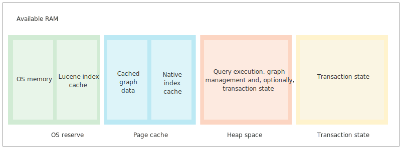

@title[Введение]

@snap[midpoint span-80]
### Низкоуровневая оптимизация программ на Haskell 
На примере библиотек двоичной десериализации
@snapend

@snap[south]
FPURE 2018
@snapend

Note:
- O себе: Сбербанк, Департамент управления данными, BigData.
- Содержание доклада: оптимизация программ, микробенчмарки, дамп кода, примеры техник низкоуровневой оптимизации
- Вступление к след сайту (почему бинарный ридер?)

---

@title[Область применения]

Графовая база данных  

- 900 млн. вершин 17 млрд. рёбер
- Данные хранятся в памяти
- Данные неизменяемы
- Запрос затрагивает небольшое количество вершин

Note:
- О себе: разработчик графовой платформы
- О графе (+ почему важно что запросы не раскрывают весь граф)
- Как представлять данные?

---

@title[Способы представления данных в памяти]

Способы представления данных в памяти

- Структуры данных
- Структуры массивов примитивных типов
- "Off-heap"

Note:
- Структуры данных
  - GC ведёт к обходу графа
    - Card marking (только для младших поколений)
    - GHC.Compact (копирование без разделения, compactWithSharing - в 10 раз медленнее)
    - Hакладные расходы (Нaskell - 1 слово на заголовок, JVM - 2 слова)
- Структуры массивов примитивных типов
  - Заимствованы из Struct of Arrays
  - Поля - только примитивные типы
  - Сложно представлять данные с переменной длинной
  - Требуется поддержка больших массивов (JVM)
- Off-heap
  - Произвольные структуры
  - Требуется эффективная бинарная сериализация
  - Прямая работа с памятью, небезопасно 

---

@title[neo4j]

@snap[north]
Конфигурация памяти neo4j
@snapend

@snap[midpoint span-100]

@snapend

Note:
- neo4j - популярная графовая база данных, написанная на java

---

@title[Off-heap в Haskell]

Off-heap в Haskell

- Foreign.Storable
- Бинарная сериализация

---

@title[Foreign.Storable]

Foreign.Storable

```haskell
class Storable a where
    sizeOf      :: a -> Int
    alignment   :: a -> Int
    peekElemOff :: Ptr a -> Int      -> IO a
    pokeElemOff :: Ptr a -> Int -> a -> IO ()
    peekByteOff :: Ptr b -> Int      -> IO a
    pokeByteOff :: Ptr b -> Int -> a -> IO ()
    peek        :: Ptr a      -> IO a
    poke        :: Ptr a -> a -> IO ()
```
Note:
- Данные фиксированных размеров
- Не безопасна
- Подходит для работы со структурами Си

---

@title[Бинарная сериализация]

Бинарная сериализация

```haskell
getPerson :: Get Person
getPerson = do 
    age     <- fromIntegral <$> getWord8
    nameLen <- fromIntegral <$> getWord8
    name    <- decodeUtf8   <$> getByteString nameLen
    return $ Person name age

readPerson :: ByteString -> Person
readPerson = runGet getPerson  
```

Note:
- Библиотека - binary
- Десериализатор модульный, состоит из более простых ридеров
- Монадический интерфейс необходим для чтения данных произвольной длины

---

@title[Disclaimer]

Любая оптимизация начинается с профилирования

Note:
- Жалоба на медленную работу в определенном сценарии использования
- Профилирование сценария использования
- Оптимизация алгоритма
- Низкоуровневая оптимизация

---

@title[Базовая оценка производительности]

Базовая оценка производительности:<br/>
12 * Word64 + Word32 (100 байт)
@code[haskell text-08](assets/src/hw/read12Int64PlusInt32.hs)

@[3]
@[4]
@[5]
@[6]
@[7]
@[8]
@[10]
@[11-12]
@[13]
@[1-13]

Note:
- Считываем 100 байт (12 Word64 и 1 Word32) и суммируем их.

--- 

@title[Базовая оценка производительности - asm dump]

@code[x86asm text-07](assets/src/hw/read12Int64PlusInt32.asm)
@[1-5] 
@[6-8] 
@[10-13] 
@[21-25]
@[15,17-18,20,27,29]
@[0-29]

Note:
- AT&T syntax
- Берём адрес, прибавляем смещение
- Читаем все значения в регистры
- По мере чтения регистры сливаются на стек
- Создание и заполнение возвращаемых структур

---

@title[Binary - код]

binary
@code[haskell text-08](assets/src/binary/read12Int64PlusInt32.hs)

Note: 
- не нужно указывать смещения
- код безопасен
- код модулярен

---

@title[Binary - результаты]

@code[txt text-06](assets/src/read12Int64HB.sh)

@code[txt text-07](assets/src/read12Int64HB.txt)
@[1-2,13-14]
@[1,9-10,13,21-22]
@[1-25]

Note:
- Разница в производительности
- Наличие GC в binary

---

@title[Дизайн binary]

binary

@code[haskell text-07](assets/src/binary/get.hs)
@[1,3-6,8,10-13]
@[15-16]
@[18-24]
@[1-24]

Note:
- Струкруты данных - функция чтения через передачу контекста и продолжения
- Монадический биндинг (собираем продолжение)
- Драйвер (запуск функции и паттерн-матчинг по результату)

---

@title[Простая функция]

@code[haskell text-07](assets/src/simplefn/Main.hs)

Note: 
- Разбор простой функции
- Используем noinline

--- 

@title[Простая функция cmm]

@code[c text-07](assets/src/simplefn/Main.cmm)
@[9-11]
@[12-16]
@[17-18]
@[19-23]
@[24-27]
@[1-29]

Note:
- Проверяем, достаточно ли места в куче, чтобы вернуть объект
- Если недостаточно, будет вызван GC (stg_gc_fun)
- Проверка логического условия
- Если выполнено, записываем в кучу info pointer Done и значение аргумента, в R1 сохраняем указатель на объект в куче.
- Если не верно, уменьшаем Hp, т.к. кучу использовать не будем, в R1 указатель на info pointer Fail.
- Если бы мы использовали стек, была бы дополнительная проверка наличия места на стеке, аналогичная проверки HpLim
- И это еще strictness analysis сработал!

---

@title[Простая функция asm]

@snap[north]
-ddump-asm
@snapend

@snap[midpoint]
@code[x86asm text-07](assets/src/simplefn/Main.asm)
@[2-5]
@[18-21]
@[6-8]
@[13-17]
@[9-12]
@[1-21]
@snapend

Note: 
- Проверка достаточно ли места в куче
- Вызов мусоросборника (аргументы пишутся в память таблицы r13, вызовы через jmp используя таблицу r13, адрес возврата в ebx)
- Сравнение
- Если не равны, пишем в кучу info pointer Done и аргумент, в ebx - ссылку
- Если равны, уменьшаем Hp, в ebx - info pointer Fail
- Все вызовы через jmp, адрес продолжения в регистре rbp кроме мусоросборника
- Метки в asm и в cmm совпадают

---

@title[Простая функция inline]


@code[haskell text-07](assets/src/simplefn/Main-Inline.hs)

Note: 
- Убираем директиву {-# NOINLINE #-}

---

@title[Простая функция inline cmm]

@snap[north]
-ddump-cmm
@snapend

@snap[midpoint]
@code[c text-07](assets/src/simplefn/Main-Inline.cmm)
@snapend

Note: 
- Функции ask нет, вся ненужная логика убрана
- main1_closure - код для построения строки "

---

@title[Простая функция inline asm]

@snap[north]
-ddump-asm
@snapend

@snap[midpoint span-80]
@code[x86asm text-07](assets/src/simplefn/Main-Inline.asm)
@snapend

---

@title[Inline, Inlinable]

@snap[north]
Встраивание (inlining)
@snapend

```Haskell
{-# INLINABLE functionName #-}
```
<br/>
```Haskell
{-# INLINE functionName #-}
```

Note:
- Инлайнинг в Хаскеле важен, потому что не просто убрает накладные расходы на вызов функций но позволяет сработать другим оптимизациям.
- Инлайнинг происходит автоматически внутри модуля, для кроссмодульного инлайнинга необходимо включить определение функции в интерфейс модуля 
(в этом отличие от JIT языков).
- В некоторых случаях Haskell может включить определение функции в интерфейс автоматически (всегда, если применён флаг -fexpose-all-unfoldings и функция не 
отмечена прагмой NOINLINE )
- При инлайнинге происходит специализация функции в точке вызова.
- Прагма INLINABLE не влияет на вероятность принятия решения о встраивании 
функции. 
- INLINE вынуждает компилятор использовать встраивание более агрессивно, но 
не гарантирует, что функция будет встроена. 
- Нет способа управлять инлайнингом в точке вызова, либо гарантированно применять инлайнинг.

---

@title[Inline, Inlinable условия]

@snap[north]
Условия встраивания
@snapend

- Применены все аргументы (fully applied)
- Функция не рекурсивная 

Note: 
- В случае взаимно рекурсивных функций выбирается loop-breaker, который
не встраивается, если биндинг, саморекурсивный, loop-breaker-ом может быть
только он сам.

---

@title[Static argument transformation]

@snap[north span-100]
Static argument transformation<br/>
-fstatic-argument
@snapend

@snap[midpoint span-80]
@code[Haskell text-08](assets/src/conduit/unfoldC.hs)
@snapend

@snap[south span-80]
@code[Haskell text-08](assets/src/conduit/map.hs)
@snapend

Note:
- Static argument transformation отключена по-умолчанию (но это не точно)

---

@title[Specialise]

```Haskell
{-# SPECIALISE #-}
```
<br/>
<br/>
@code[Haskell text-08](assets/src/specialise/sort.hs)

---

@title[Specialise в attoparsec]


@code[Haskell text-08](assets/src/specialise/atto.hs)

Note:
- Почему не inline?
- Применять прагмы следует если есть бенчмарки.
- Если функция Inlinable, она может быть специализирована в другом модуле.

---

@title[Specialise Inline]

@code[Haskell text-08](assets/src/specialise/inline.hs)

Note:
- Пример из документации.

---

@title[Провал встраивания в Binary]

Binary

@code[Haskell text-08](assets/src/binary/inlineFailure.hs)

---

@title[Провал встраивания в Binary cmm]

@code[c text-08](assets/src/binary/inlineFailure.cmm)

---

@title[Binary readN]

@code[Haskell text-08](assets/src/binary/readN.hs)

---

@title[Lazy vs Strict]

Библиотеки бинарной сериализации

- binary
- cereal
- protocol-buffers
<br/>
<br/>
- store
- persist
- flat

---

@title[Store bench код]

Store

@code[Haskell text-08](assets/src/store/read12Int64.hs)

---

@title[Store bench результаты]

Store

@code[txt text-08](assets/src/store/read12Int64.txt)

---

@title[Store](Store дизайн)

Store: Peek

@code[Haskell text-08](assets/src/store/peek.hs)

---

@title[Store](Store cmm)

Store cmm

@code[c text-07](assets/src/store/store.cmm)

Note:
- Последовательные ридеры превращены в последовательность команд.
- Нет выделений памяти внутри цикла.
- Если проверки диапазона и увеличенине указателя в каждом ридере.

---

@title[Store](Store 1M bench)

Store 1M

@code[txt text-07](assets/src/read1MHS.txt)

Note:
- Смещения и размеры структур с фиксированным лейаутом можно вычислить статически во время компиляции.

---

@title[Store](Singletons)


Note:
- Синглетоны - типы имеющие ровно одно значение
- Singletons позволяет производить практически любые вычисления над типами и получать значения
- Нас интересуют натуральные числа (GHC.TypeLists) и операция сложения

---

@title[Store](Fixed layout reader)

Ридер для данных с фиксированным расположением 

@code[Haskell text-08](assets/src/lev/ti.hs)

---

@title[Store](Rebindable syntax)

```Haskell
{-# LANGUAGE RebindableSyntax #-}
```

@code[Haskell text-08](assets/src/lev/rs.hs)

---

@title[Store](Примитивные ридеры)

Примитивные ридеры

@code[Haskell text-08](assets/src/lev/sr.hs)

---

@title[Store](Dymanic Reader)

Ридер для данных с не фиксированным расположением 

@code[Haskell text-08](assets/src/lev/ dr.hs)

---